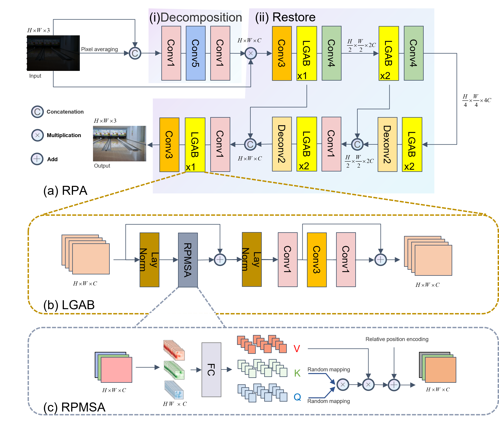

# Retinexformer on Performer Attention (RPA)

This repository contains the official PyTorch implementation of **"Retinexformer on Performer Attention (RPA)"**, a novel low-light image enhancement (LLIE) model that integrates Retinex-based illumination decomposition with Performer-based attention enhanced by relative position encoding.

> 📘 Paper: *Retinexformer on Performer Attention for Robust Low-Light Image Enhancement*  
> 📍 Submitted to [Soft Computing]    

---

## 🌟 Highlights

- 💡 Combines Retinex theory with linear-complexity attention (Performer)
- 🔍 Introduces RPMSA: Relative-Performer Multi-Head Self-Attention
- 🎯 Outperforms existing LLIE models under both SDR and HDR conditions
- 🧠 Supports high-resolution input with low computational cost

---

## 🏗️ Framework Overview

RPA consists of two stages:

1. **Illumination Decomposition**: Brightens low-light images using Retinex-based modeling.
2. **Restoration Network**: Enhances structural details using RPMSA.

<p align="center">
  
</p>

---

## 📦 Requirements

- Python >= 3.8  
- PyTorch >= 1.10  
- torchvision  
- OpenCV  
- tqdm

Install dependencies:

```bash
pip install -r requirements.txt


## 📥 Model Access

If you require pretrained model weights for evaluation or reproduction, feel free to contact us directly at:

📧 **yijindiao@163.com**

We are happy to share the weights upon request.
