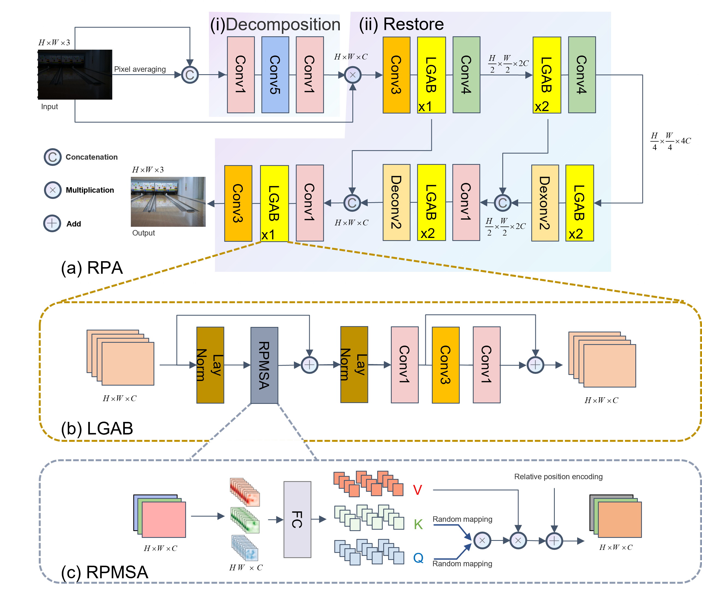

# Retinexformer on Performer Attention (RPA)

This repository contains the official PyTorch implementation of **"Retinexformer on Performer Attention (RPA)"**, a novel low-light image enhancement (LLIE) model that integrates Retinex-based illumination decomposition with Performer-based attention enhanced by relative position encoding.

> 📘 Paper: *Enhancing Low-Light Images with Performer Attention: A Retinex-Based Approach*  
> 📍 Submitted to [Soft Computing]    

---

## 🌟 Highlights

- 💡 Combines Retinex theory with linear-complexity attention (Performer)
- 🔍 Introduces RPMSA: Relative-Performer Multi-Head Self-Attention
- 🎯 Outperforms existing LLIE models under both SDR and HDR conditions
- 🧠 Supports high-resolution input with low computational cost

---

## 🏗️ Framework Overview

RPA consists of two stages:

1. **Illumination Decomposition**: Brightens low-light images using Retinex-based modeling.
2. **Restoration Network**: Enhances structural details using RPMSA.

  

---

## 📦 Requirements

- Python >= 3.8  
- PyTorch >= 1.10  
- torchvision  
- OpenCV  
- tqdm

##  Prepare Dataset
Download the following datasets:

LOL-v1 [Baidu Disk](https://pan.baidu.com/s/1ZAC9TWR-YeuLIkWs3L7z4g?pwd=cyh2) (code: `cyh2`), [Google Drive](https://drive.google.com/file/d/1L-kqSQyrmMueBh_ziWoPFhfsAh50h20H/view?usp=sharing)

LOL-v2 [Baidu Disk](https://pan.baidu.com/s/1X4HykuVL_1WyB3LWJJhBQg?pwd=cyh2) (code: `cyh2`), [Google Drive](https://drive.google.com/file/d/1Ou9EljYZW8o5dbDCf9R34FS8Pd8kEp2U/view?usp=sharing)

SID [Baidu Disk](https://pan.baidu.com/share/init?surl=HRr-5LJO0V0CWqtoctQp9w) (code: `gplv`), [Google Drive](https://drive.google.com/drive/folders/1eQ-5Z303sbASEvsgCBSDbhijzLTWQJtR?usp=share_link&pli=1)

SDSD-indoor [Baidu Disk](https://pan.baidu.com/s/1rfRzshGNcL0MX5soRNuwTA?errmsg=Auth+Login+Params+Not+Corret&errno=2&ssnerror=0#list/path=%2F) (code: `jo1v`), [Google Drive](https://drive.google.com/drive/folders/14TF0f9YQwZEntry06M93AMd70WH00Mg6)

SDSD-outdoor [Baidu Disk](https://pan.baidu.com/share/init?surl=JzDQnFov-u6aBPPgjSzSxQ) (code: `uibk`), [Google Drive](https://drive.google.com/drive/folders/14TF0f9YQwZEntry06M93AMd70WH00Mg6)

